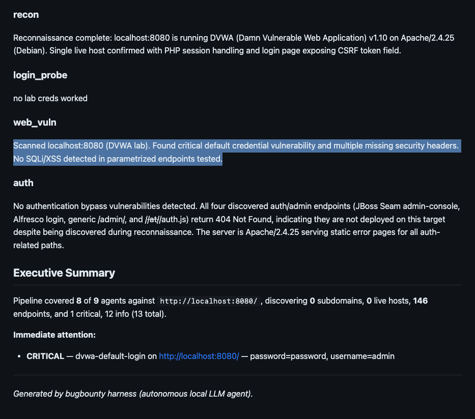
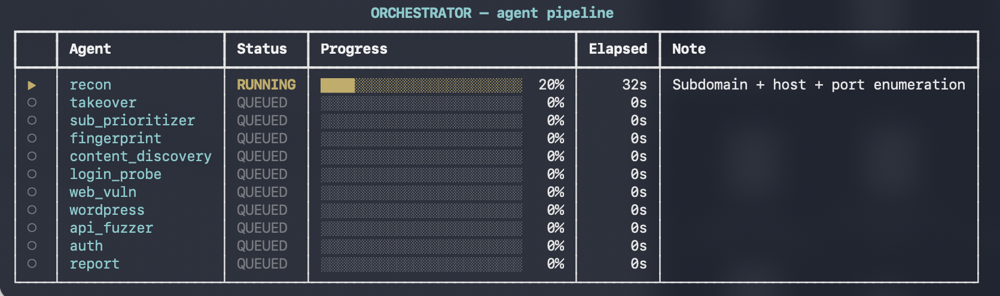
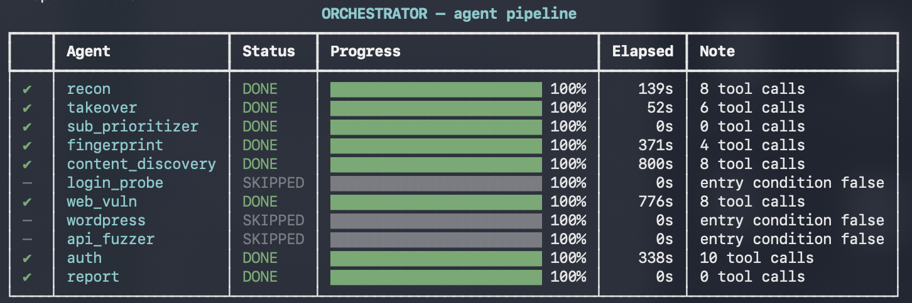

# Bughunter Harness



Autonomous local-LLM pentest agent. Multi-agent orchestrated pipeline (recon → **sub prioritizer** → fingerprint → content discovery → **login probe (lab only)** → web vuln scan (+ sqlmap + dalfox on parameterized endpoints) → wordpress → api fuzzer → auth → report → **adversarial review**) driven by any OpenAI-compatible LLM (LM Studio, Ollama, Llama.cpp, or a cloud provider). Rate-limited, scope-gated, redacted-by-default. Attribution headers, email + Telegram notifications, temp-file cleanup, and a live progress panel. **Multi-host mode** loops the scanning agents over the top-N ranked subs. **Drop-in extension framework** (`extensions/agents/*.py`, `extensions/tools/*.yaml`, `extensions/techniques/*.md`) — add a new pipeline stage, a new binary or a new playbook without touching core code.

**Design goals** — safe by default (rate limit, scope allowlist, redact secrets, no destructive commands), model-agnostic, plug-and-play with the arsenal you already have on your machine.

Read `harness.py --help` for the full flag reference.

---

## Requirements

### 1. Python

- **Python 3.10+** (uses `str | None` syntax and `type | X` unions).
- `pip` / `venv` (bundled with Python).

### 2. Docker (optional, for lab targets)

- **Docker Desktop** (macOS/Windows) or `docker` CLI (Linux). Only needed if you want to spin up local vulnerable apps (DVWA, Juice Shop, VulHub, …) to test the pipeline.

### 3. LLM backend (pick one)

The harness auto-probes local backends in this order. Also accepts cloud providers with explicit `--servertype`.

| Backend | Install | Default endpoint |
|---|---|---|
| **LM Studio** | https://lmstudio.ai (GUI + local server) | `http://127.0.0.1:1234/v1` |
| **Ollama** | `brew install ollama` (macOS) / official installer | `http://127.0.0.1:11434/v1` |
| **Llama.cpp** | `brew install llama.cpp` (macOS) then `llama-server -m model.gguf --port 8080` | `http://127.0.0.1:8080/v1` |
| **OpenAI** | `export OPENAI_API_KEY=sk-...` | `https://api.openai.com/v1` |
| **Anthropic** | `export ANTHROPIC_API_KEY=sk-ant-...` | `https://api.anthropic.com/v1` |
| **NVIDIA NIM** | `export NVIDIA_API_KEY=nvapi-...` (build.nvidia.com) | `https://integrate.api.nvidia.com/v1` |
| **Google Gemini** | `export GEMINI_API_KEY=AIza...` (ai.google.dev) | `https://generativelanguage.googleapis.com/v1beta/openai` |

**Recommended for privacy + zero cost**: run any 7B–35B model locally in LM Studio or Ollama. Cloud backends work fine but you pay per token and traffic leaves your machine.

**⭐ Recommended model for this harness — `Qwen3.5-35B-A3B-uncensored-bughunter-v8`**
([mmp2055/Qwen3.5-35B-A3B-uncensored-bughunter-v8 on Hugging Face](https://huggingface.co/mmp2055/Qwen3.5-35B-A3B-uncensored-bughunter-v8)).
A Qwen 3.5 35B MoE (3B active params) fine-tuned specifically for bug-bounty /
offensive-security workflows: prefers concrete tool calls over hand-wavy prose,
knows nuclei / ffuf / sqlmap / dalfox / gau / katana / dnsx flags without
hand-holding, and doesn't refuse lab-only default-cred probes on DVWA / Juice
Shop / Mutillidae. Runs comfortably on a single Mac (Apple Silicon,
≥ 32 GB RAM) via LM Studio. The default `llm.model` in
[`config.example.yaml`](config.example.yaml) is pinned to this model — change
it if you prefer a different backend.

Setup with LM Studio (fastest path):

1. Install LM Studio → https://lmstudio.ai
2. Search & download **`mmp2055/Qwen3.5-35B-A3B-uncensored-bughunter-v8`** (~19 GB Q4_K_M).
3. In LM Studio → *Developer* → *Local Server* → **Start Server** on port 1234.
4. Turn **OFF Speculative Decoding** in the model's *Settings* (Qwen 3.5 MoE
   fails to load with MTP on).
5. Enable **Tool Use** in the model's *Settings* (required for the agent
   pipeline).

### 4. Offensive tools (nuclei / ffuf / etc.)

The agents run these binaries via `run_shell`. Install what you plan to use — nothing is required, but with more tools installed the harness discovers more.

**One-liner install (macOS Homebrew, most useful subset):**
```bash
brew install nuclei ffuf httpx subfinder katana nmap nikto \
             feroxbuster wpscan dnsx naabu jq \
             sqlmap
# Optional: gau, waybackurls, whois, dig (dig ships with macOS)
brew install gau waybackurls
# Active XSS scanner (dalfox is only on go)
go install github.com/hahwul/dalfox/v2@latest
```

**On Linux (apt)** most of these come from the ProjectDiscovery `go install` route:
```bash
# ProjectDiscovery bundle
for tool in nuclei ffuf httpx subfinder katana dnsx naabu; do
  go install -v github.com/projectdiscovery/$tool/v3/cmd/$tool@latest
done
sudo apt install nmap nikto wpscan jq sqlmap
# Active XSS scanner
go install github.com/hahwul/dalfox/v2@latest
```

**Update nuclei templates** on first run (or periodically):
```bash
nuclei -update-templates
```

**Why `sqlmap` + `dalfox` matter**: nuclei/nikto are CVE-oriented (they catch known-vulnerable versions and misconfigurations). Real modern apps ship without exploitable CVEs but leak SQLi/XSS through their own custom code. The `web_vuln` agent runs `dalfox url` + `sqlmap --batch --smart --level=1 --risk=1` against every endpoint the `content_discovery` agent found with GET parameters — that is the difference between "0 findings" and "the SQLi/XSS this app actually has".

### 5. Wordlists — SecLists

Several agents (content discovery, api fuzzer) invoke `ffuf` with a wordlist from **SecLists** at the default path `/opt/homebrew/share/seclists/…`. Install once:

```bash
# macOS / Linux (git clone, ~1.5 GB uncompressed)
sudo git clone --depth 1 https://github.com/danielmiessler/SecLists.git \
     /opt/homebrew/share/seclists

# Or tarball if git is slow (~250 MB compressed)
curl -sL https://github.com/danielmiessler/SecLists/archive/refs/heads/master.tar.gz \
     -o /tmp/seclists.tar.gz
sudo mkdir -p /opt/homebrew/share && cd /opt/homebrew/share
sudo tar -xzf /tmp/seclists.tar.gz && sudo mv SecLists-master seclists
sudo rm /tmp/seclists.tar.gz
```

If your system uses a different path (e.g. `/usr/share/seclists/`), the agents fall back to `ls`-and-probe common locations. Adjust prompt in `agents/content_discovery.py` if none fit.

### 6. (Optional) `mailpit` for local email testing

If you want to receive the end-of-pipeline email but don't want to configure a real SMTP relay, install [Mailpit](https://mailpit.axllent.org/):
```bash
brew install mailpit && mailpit
# Web UI: http://localhost:8025
# SMTP:   127.0.0.1:1025
```
Then in `config.yaml`:
```yaml
smtp:
  host: "127.0.0.1"
  port: 1025
  from: "harness@localhost"
  username: ""
  default_to: "you@localhost"
```

### 7. (Optional) Telegram bot

For end-of-pipeline Telegram notifications:
1. In Telegram, talk to `@BotFather` → `/newbot` → save the token.
2. Start a chat with your new bot (send any message).
3. Get your `chat_id`:
   ```bash
   curl -s "https://api.telegram.org/bot<TOKEN>/getUpdates" | jq '.result[0].message.chat.id'
   ```
4. Either export the token as an env var:
   ```bash
   export TELEGRAM_BOT_TOKEN='123456:ABC-DEF...'
   ```
   Or paste it directly in `config.yaml → telegram.bot_token`.
5. Enable in `config.yaml`:
   ```yaml
   telegram:
     enabled: true
     chat_id: "your-chat-id-here"
   ```

---

## Setup (one time)

```bash
git clone https://github.com/<your-fork>/bughunter-harness.git
cd bughunter-harness
python3 -m venv .venv
source .venv/bin/activate
pip install --upgrade pip
pip install -r requirements.txt

# Copy templates
cp config.example.yaml config.yaml
cp scope.example.txt scope.txt

# Edit config.yaml (backend, SMTP/Telegram optional, custom_headers, …)
# Edit scope.txt with the hostnames you are authorized to test
```

---

## Quick start

```bash
source .venv/bin/activate
python harness.py
```

At the prompt:
```
Objective (one-line goal for the agent). Type /quit or /bye to exit.
Inline flags (sticky): --email ADDR  --scope PAT (repeat)  -o PATH

> http://localhost:3000/
```


*Pipeline start — target and agent queue announced, first agents entering `RUNNING`.*


*Pipeline complete — every agent's final status, elapsed time and note.*

The orchestrator will run the 10 core agents (+ any extension) in sequence and produce a `sessions/<run-id>/REPORT.md` at the end.

**Pipeline (order matters — cookies from `login_probe` feed into `web_vuln`):**
1. `recon` — subdomain + host + port enumeration + free Shodan InternetDB enrichment per live IP
2. `sub_prioritizer` — deterministic 6-signal ranker; reorders `state.live_hosts` so the juiciest sub is `[0]` (see "Multi-host mode" below)
3. `fingerprint` — tech-stack detection
4. `content_discovery` — hidden paths + historical URLs (adds `-H "Cookie: …"` if `login_probe` already captured one; usually it hasn't yet on first pass)
5. `login_probe` — **LAB ONLY** (localhost / private IP / DVWA / Juice Shop / Mutillidae / bWAPP / WebGoat) — tries 6 stock default-cred pairs (`admin:password`, `admin:admin`, …), harvests the session cookie into `state.session_cookies`
6. `web_vuln` — nuclei + nikto + **sqlmap** and **dalfox** against parameterized endpoints, with the cookie from step 5 auto-injected
7. `wordpress` — wpscan JSON + WPScan CVE-DB cross-match (if WordPress detected; see "WPScan API" below)
8. `api_fuzzer` — API surface + BOLA/BFLA hints
9. `auth` — auth-bypass + SSO/OAuth misconfig
10. `report` — deterministic Markdown consolidator (+ auto post-run `adversarial_review` unless quick mode)

Extension agents (drop-in under `extensions/agents/*.py`) splice themselves according to their `ENTRY_AFTER` — the shipped `example_takeover.py` runs right after `recon` and checks every discovered sub for dangling CNAMEs.

**Quick mode is ON by default** — the pipeline runs a fast triage pass first (skips `login_probe`, `wordpress`, `api_fuzzer`, `auth` + adversarial review) and, if signal is found, auto-escalates to the full set. See "Quick mode" below for the full flow.

**REPL guard** — the objective prompt catches typos of `/quit`, `/bye`, `/exit` (via Damerau-Levenshtein distance 1 — e.g. `by`, `quti`, `exti`) and validates that your input looks like a scannable target (URL / host with TLD / IP / CIDR / wildcard) or a ≥4-word natural-language objective. It prints an inline command reference on any unrecognized input instead of starting a scan against garbage.

**Auto-inferred in-scope** — when you launch a scan without `--scope`, the harness parses the target for a hostname and populates `state.in_scope_hosts` with `[hostname]` automatically. Prints `[+] No --scope given; inferred in_scope_hosts from target: [www.target.com]`. Without this fallback the multi-host filter (see below) would have no scope guardrail — any sub_prioritizer HIGH-ranked sub would slip through. Pass `--scope 'pattern'` (repeatable) explicitly when you need wildcards or additional patterns beyond the target's own hostname.

**Full help** (all flags and behaviours):
```bash
python harness.py --help
```

---

## Trying it against known-vulnerable targets

Instead of a real bug-bounty scope, spin up a lab container:

**OWASP Juice Shop** (Node.js + Angular SPA — CTF-style vulns):
```bash
docker run --rm -d --name juice -p 3000:3000 bkimminich/juice-shop
# Point the harness at:  http://localhost:3000/
docker kill juice   # stop
```

**DVWA** (PHP classic — CVE-style vulns, easier to detect):
```bash
docker run --rm -d --name dvwa -p 8080:80 vulnerables/web-dvwa
# First open http://localhost:8080/setup.php → "Create/Reset Database"
# Point the harness at:  http://localhost:8080/
docker kill dvwa
```

---

## Configuration summary

Everything lives in `config.yaml`. Key sections:

| Section | Purpose |
|---|---|
| `llm.*` | LLM backend + model + API key |
| `min_request_interval_sec` | Global rate limit (default 1 req/s) |
| `shell_timeout_sec` | Per-command timeout (default 900 s — nuclei/wpscan full scans need it) |
| `custom_headers` | HTTP headers attached to every request (attribution) |
| `scope_file` / `scope_enforcement` | In-scope allowlist file + mode (strict/warn/off) |
| `oob_host` | Your self-hosted OOB catcher (for blind vuln PoCs) |
| `smtp.*` | Email destination (with `default_to` for automatic send) |
| `telegram.*` | Telegram bot token + chat_id |
| `notify_only_if_findings` | Only send email + Telegram if run produced findings |
| `cleanup_tempfiles` | Wipe `/tmp/harness-*` etc. after each run |
| `adversarial_review.*` | Post-pipeline finding gate (see "Adversarial review" below) |
| `multi_host.*` | Loop scan over top-N ranked subs (see "Multi-host mode" below) |
| `wpscan.*` | WPScan Vulnerability DB API token (see "WPScan API" below) |
| `shodan.*` | Shodan free InternetDB + optional Pro API (see "Shodan integration" below) |
| `extensions.*` | Drop-in extension framework toggle + extra_dirs (see "Extending" below) |

See `config.example.yaml` inline comments for every field.

---

## Multi-host mode (loop scan over ranked subdomains)

Default is single-host: the pipeline scans `state.live_hosts[0]` only. That's fine when your target is one URL, but on wildcard targets like `--scope "*.example.com"` you'd miss `admin.example.com` / `dev.example.com` / `api.example.com` etc.

**Auto-activation**: if any `--scope` pattern starts with `*.` (a wildcard, e.g. `--scope '*.example.com'`), multi-host is **auto-enabled** for that run — it's almost always what you want on a wildcard target. Override with `--single-host` if you specifically want to scan only the primary URL.

**Enable multi-host manually** with `--multi-host` (per run) or `multi_host.enabled: true` in `config.yaml`. The pipeline splits into 3 phases:

- **Phase 1** (once): `recon → sub_prioritizer` (+ any non-repeated agent, e.g. an extension like `takeover`).
- **Phase 2** (once per host in queue): `fingerprint → content_discovery → login_probe → web_vuln → wordpress → api_fuzzer → auth`.
- **Phase 3** (once): `report`.

### Phase 2 queue selection — original target always first, out-of-scope subs diverted

The Phase 2 queue is built from two sources, in this order:

1. **The original target** the operator supplied — ALWAYS runs first, as a synthetic entry with `tier=ORIGINAL`. Guarantees at least one full-pipeline pass against what you actually asked for.
2. **Sub_prioritizer's top-N subs** — but ONLY those whose hostname matches your in-scope allowlist (`ScopeChecker.is_in_scope(host)`).

Subs that `sub_prioritizer` marked HIGH but that are **out of scope** never get scanned. They're recorded in `state.suggested_additional_targets` and surfaced in `REPORT.md` under a `## Suggested Additional Targets` section — you decide whether to expand scope and re-run, or leave them alone.

**Why this matters**: without the filter, a sub_prioritizer ranking of `cpanel.target.com` (admin-panel keyword → score 56) above `www.target.com` (bare www → score 33) would silently REPLACE `www` in the scan queue. Every downstream agent (wordpress, web_vuln, content_discovery) would attack cpanel — 55+ min wasted on the wrong host, zero coverage of the target the operator explicitly asked for. Now the operator's target is guaranteed to run, and admin subs surface as suggestions rather than hijacked scans.

### `sub_prioritizer` — the ranker

Deterministic (no LLM). Scores every `state.live_hosts` entry on 6 signals and reorders them so the juiciest sub is `[0]`:

| Signal | Weight | Examples |
|---|---|---|
| **Name** (max of tokens) | up to **+40** | `admin/jenkins/gitlab/grafana/portainer/vault/adminer/phpmyadmin/k8s`=+40 · `dev/staging/qa/sandbox`=+35 · `api/graphql`=+30 · `internal/vpn/mgmt`=+25-30 · `mail/db/monitor`=+15-30 · `www/cdn/images`=+3-5 · negative for third-party managed hosts (`clerk`, `firebaseapp`, `netlify`, `vercel`, `githubusercontent` → -5 to -10) |
| **HTTP status** | up to **+15** | 401/403 (auth-protected)=+15 · 5xx (server broken/exploitable)=+12 · 429=+8 · 2xx=+8 · 3xx=+5 · 404=-5 |
| **Detected tech** | up to **+35** | jenkins/gitlab/grafana/adminer/portainer/dokploy/elasticsearch/vault/k8s-dashboard=+30-35 · wordpress/drupal/magento=+20-25 · nginx/apache=+3 |
| **Title sniffing** | ±20 | `index of /`=+15 · `admin panel`=+12 · `login`=+8 · `for sale`/`parked`/`expired`/`suspended` → **HARD-CAP: total score ≤15 (LOW)** |
| **Unusual ports** | up to +25 | 2375/2376 (Docker daemon)=+20 · 3306/5432/27017/6379 (DBs)=+15 · 9200 (Elasticsearch)=+12 · 8080/8443=+8 |
| **Shodan InternetDB** (free enrichment — see "Shodan integration") | up to +30 | Known CVE match=+25 · juicy tag (`admin_panel`/`database`/`iot`/`vpn`/`docker`)=+15 · rare port open (Redis/Mongo/Elastic/Docker/Kibana)=+10 |
| **Penalty** | -15 | Random hex label (≥16 chars) or UUID-like → -15 |
| **Anti-bot challenge** | -30 | Cloudflare/DataDome/PerimeterX/Sucuri challenge page detected — non-browser tools can't pass, wastes multi-host budget |

**Tiers**: `≥60 CRITICAL` · `≥40 HIGH` · `≥20 MEDIUM` · `<20 LOW`.

Findings from each per-sub pass are tagged `sub_scanned=<host>` and grouped per-subdomain in the REPORT.md's `## Findings` section.

### Selection: `top_n` and `min_score`

```yaml
multi_host:
  enabled: true
  top_n: 3               # scan top-3 subs
  min_score: 30          # only include subs with score >= 30
                         # (falls back to top-N if nothing meets it)
```

Override per run: `--top-hosts 5` · `--multi-host` (force on) · `--single-host` (force off).

### Cost

**Linear in `top_n`.** With LM Studio + Qwen v8 bughunter, each per-sub pass is ~25-40 min. `top_n=3` ≈ 1h20m end-to-end. Speed knobs: `--skip-preflight`, `--no-adversarial`, lower `MAX_ITERATIONS` per agent in config.

### Example

```bash
# Recon-first: see WHICH subs subfinder finds + how they rank
python harness.py --scope "*.example.com" --objective "https://example.com/"

# Read the "## Subdomain Prioritization" table in REPORT.md, then:
python harness.py --multi-host --top-hosts 3 --scope "*.example.com" \
                  --objective "https://example.com/"
```

---

## Quick mode (default — fast triage with auto-escalate)

The pipeline ships with **`quick_mode.enabled: true`** by default. Every run is a fast triage pass first:

- **Skips**: `login_probe`, `wordpress`, `api_fuzzer`, `auth`, and `adversarial-review`
- **Reduces**: `fingerprint`, `content_discovery`, `web_vuln` — MAX_ITERATIONS halved + system-prompt reminder tells them to skip heavy shell tools (`ffuf`, `sqlmap`, `dalfox`, `nikto -full`) and prefer `nuclei -tags cve,exposures -severity high,critical`
- **Duration**: ~8-15 min single-host, ~15-25 min multi-host top-1

When the quick pass finishes, the orchestrator evaluates **escalate criteria** against `state`:

- Any finding with `severity >= escalate_min_severity` (default `high`)
- Any tech in `high_value_techs` matched (jenkins / gitlab / grafana / portainer / dokploy / n8n / adminer / phpmyadmin / webmin / switchvox / wordpress …)
- Any CVE match in `state.cves_matched`
- Any prioritized host with `score >= escalate_min_host_score` (default 40)
- Any takeover finding (dangling CNAME)

If any criterion fires:

- **DEFAULT** (`quick_mode.auto_escalate: true` in config) → escalates automatically, no prompt.
- With `quick_mode.auto_escalate: false` in config → prompts `[y/N]` with a 30 s timeout (any other answer / timeout / non-TTY = declined).
- With `--no-escalate` (or `quick_mode.auto_escalate: false` + timeout) → REPORT.md gets an `💡 Escalate suggested` block with the reasons — you can re-run with `--complete` later.

When escalated, the previously-skipped agents (`login_probe`, `wordpress`, `api_fuzzer`, `auth` + `adversarial-review`) run on the accumulated `state` — no wasted work.

**Overrides**:

| Flag | Effect |
|---|---|
| `--complete` | Force full pipeline for this run (skip quick entirely) |
| `--quick` | Force quick even if disabled in config |
| `--auto-escalate` | Force auto-escalate for this run (redundant with the default — useful only when config has `auto_escalate: false`) |
| `--no-escalate` | Never escalate for this run; always leave "Escalate suggested" in REPORT.md (wins over `auto_escalate`) |

Config in [`config.example.yaml → quick_mode:`](config.example.yaml).

---

## Adversarial review (post-pipeline finding gate)

After the report agent runs, every finding whose severity is ≥ `min_severity` (default `medium`) is sent to an LLM with a strict **7-question gate**:

1. Is there a **specific** endpoint / parameter / asset named?
2. Is the impact **concrete and demonstrable**?
3. Does the claimed severity **match the evidence**?
4. Would a triager **reproduce** this with only the evidence given?
5. Is it **in-scope** (not an informative-only issue class)?
6. Would the program **actually pay** for it?
7. Is it **not a known-duplicate class** (missing security headers alone, SPF/DMARC, EXIF, server-banner disclosure)?

Findings that fail even one question are moved out of the notification path — they still appear in the `Adversarial Review` section of `REPORT.md` with the reason, so nothing is lost, but only signal reaches your inbox.

**Cost**: one LLM call per eligible finding, `max_tokens=200`, `temperature=0.1` → seconds per run in the typical case. Extra guardrails: `min_severity` filter, `max_findings: 20` cap, `--no-adversarial` per-run kill switch.

**Reviewer model**: by default the SAME model as the main pipeline (single LM Studio slot is enough). Override `adversarial_review.model` (or `--adversarial-model MODEL_ID`) to use a different backend for the review — e.g. local Qwen for the agents and cloud Sonnet for the reviewer.

**Fail-open**: if the reviewer LLM is down, findings pass through ungated rather than get silently lost.

Configure in [`config.example.yaml`](config.example.yaml) → `adversarial_review:` section. Disable with `enabled: false` or CLI `--no-adversarial`.

---

## WPScan API — WordPress Vulnerability DB integration

The `wordpress` agent uses [WPScan](https://wpscan.com/) to enumerate plugins, themes and users, and — when an **API token** is configured — to cross-match every detected version against the [WPScan Vulnerability Database](https://wpscan.com/wordpresses/) for known CVEs. Without a token, wpscan still enumerates plugins/versions but returns **0 CVE matches** even when a plugin is outdated.

**Free tier**: 25 requests/day. Register at https://wpscan.com/register.

**Configure in `config.yaml`:**

```yaml
wpscan:
  api_token: "PASTE_YOUR_TOKEN_HERE"     # direct value (higher precedence)
  api_token_env: "WPSCAN_API_TOKEN"      # env var fallback if api_token empty
```

Or export the env var:

```bash
export WPSCAN_API_TOKEN='your_token_here'
```

**Injection mechanics**: on `build_objective`, the wordpress agent reads the resolved token and exports it to `os.environ["WPSCAN_API_TOKEN"]` so every subprocess it spawns inherits it. The system prompt tells the LLM to append `--api-token "$WPSCAN_API_TOKEN"` to wpscan commands ONLY when the objective says `WPScan API token: available` (passing an empty `--api-token` value makes wpscan exit with an error).

### Quota-exhausted auto-fallback (session-sticky)

The free tier's 25/day limit is easy to hit on multi-host runs. When the wordpress agent detects any of these markers in a wpscan response:

- `daily limit`
- `You have reached the maximum`
- `API request limit reached`
- `reached the daily`

…it flags `state.wpscan_api_exhausted = True` for the rest of the session. The next call to `build_objective` un-exports the env var → the LLM sees `WPScan API token: EXHAUSTED (daily limit reached)` and OMITs the `--api-token` flag automatically. **No manual intervention.** Plugin/theme/user enumeration still runs; only the CVE-DB cross-match is disabled until the quota resets (midnight UTC) or you upgrade the plan.

The final REPORT.md includes a `⚠️ Meta-check warnings` block explaining exactly what happened so you know why any HIGH/CRITICAL plugin CVE was missed.

### wpscan output → structured findings

The agent runs wpscan with `--format json -o /tmp/harness-wpscan.json` and parses the JSON deterministically. Each plugin/theme vulnerability becomes a `finding` entry with:

- Severity mapped from CVSS (`>=9.0 critical`, `>=7.0 high`, `>=4.0 medium`, `>0 low`)
- Title, evidence line (product/version/target/CVSS/fixed_in)
- CVE identifiers (linked to NVD in the recommendation)
- Direct upgrade recommendation (`Upgrade <slug> to >= <fixed_in>`)

Plugins detected without matching CVEs still appear as INFO entries — useful audit trail of what was enumerated.

**Installation**: `gem install wpscan` (needs Ruby). On macOS: `brew install ruby && gem install wpscan` — you may need to add the gem bin dir to PATH (`ls /opt/homebrew/lib/ruby/gems/*/bin/wpscan` — symlink to `/opt/homebrew/bin/wpscan` if not already there).

---

## Shodan integration (free InternetDB + optional Pro)

Two-tier Shodan enrichment. **Tier 1 (InternetDB)** runs automatically on every scan for zero cost. **Tier 2 (Pro search)** is opt-in with a hard throttle to protect your quota.

### Tier 1 — InternetDB (free, no key, always on)

The `recon` agent resolves each `live_host` to its IP and hits `https://internetdb.shodan.io/<ip>` — [Shodan's free open-data service](https://internetdb.shodan.io/) covering ~9M internet-exposed hosts. No API key required, no per-account rate limit. Each host record gets enriched with:

- Open ports
- Known CVEs (from Shodan's vulnerability index)
- Tags (`admin`, `database`, `iot`, `vpn`, `cctv`, `ics`, `docker`, `kubernetes`, …)
- Alternative hostnames
- CPEs

The `sub_prioritizer` picks these up as a **6th signal** and bumps scores:

| Signal | Weight |
|---|---|
| Known CVE match (proof of vuln — no probing needed) | **+25** |
| Juicy tag (admin_panel / database / iot / vpn / cctv / ics / docker) | **+15** |
| Rare service port open (Redis 6379 / Mongo 27017 / Elastic 9200 / MySQL 3306 / Postgres 5432 / Docker 2375 / Kibana 5601) | **+10** |

Cap +30 total so one super-juicy Shodan record can't dominate. The full breakdown surfaces in the REPORT.md `## Shodan InternetDB Enrichment` section (per-host: ports / CVEs / tags / CPEs / hostnames).

Disable with `shodan.internetdb_enabled: false`.

### Tier 2 — Shodan Pro search (paid, quota-throttled)

When you configure a Shodan Pro API key, the LLM gains a `shodan_search(query, limit)` tool for pivots that InternetDB can't answer:

- `http.favicon.hash:-1234567890` — asset discovery by favicon
- `org:"Target Inc"` — every host in the target's org
- `ssl.jarm:xxxxx` — JARM fingerprint pivot
- `product:jenkins country:US` — product + geo filters
- Cert SAN searches, HTTP title regex, …

**Configure in `config.yaml`:**

```yaml
shodan:
  api_key: ""                          # your Pro key (or leave empty and use env)
  api_key_env: "SHODAN_API_KEY"        # env var fallback
  max_pro_calls_per_run: 2             # HARD throttle — LLM can't bypass
  internetdb_enabled: true             # Tier 1 stays on regardless
```

Register a Pro plan at https://account.shodan.io.

### Quota-exhausted auto-fallback (session-sticky)

Shodan Pro has a monthly query quota. When `_shodan_search` detects:

- HTTP 402 (no credits)
- HTTP 200/4xx body containing `no query credits`, `insufficient credits`, `monthly query limit`, `quota exceeded`

…it flags `self.shodan_pro_exhausted = True` for the rest of the session. Subsequent `shodan_search` calls short-circuit to `ERROR: Shodan Pro credits exhausted` without spending another attempt. The LLM sees the error and falls back to `shodan_internetdb` (still free, still working).

The final REPORT.md's `⚠️ Meta-check warnings` block explains it happened and points to `https://account.shodan.io` for top-up.

### Throttle guarantee

`max_pro_calls_per_run` is enforced in `ToolRegistry`, not in the prompt — the LLM CANNOT bypass it. Once the counter hits the limit, every subsequent `shodan_search` returns `ERROR: Shodan Pro throttle exhausted for this run` and points the agent to InternetDB.

---

## Extending — drop-in agents / tools / techniques

Bughunter Harness ships with a three-slot extension framework. Drop a file into `extensions/`, restart the harness, and it is live. No core changes, no plugin registration, no rebuild.

```
extensions/
├── agents/                             (1) new agents in the pipeline
│   └── example_takeover.py             minimum working example
├── tools/                              (2) new binaries in the shell allowlist
│   └── example_subjack.yaml            binary + install_hint + prompt_hint
└── techniques/                         (3) knowledge base loaded by context
    └── example_prototype_pollution.md  YAML frontmatter + markdown body
```

**Agents** — any subclass of `BaseAgent` in `extensions/agents/*.py` is spliced into the pipeline. Position controlled by class attribute `ENTRY_AFTER = "recon"` (or any other built-in agent NAME).

**Tools** — a YAML file registers a new binary with the shell allowlist and gives the model a prompt hint on WHEN and HOW to invoke it via `run_shell`.

**Techniques** — markdown files with YAML frontmatter. Loaded into an agent's system prompt ONLY when the current target context matches the frontmatter's `applies_when` rules (detected techs, endpoint globs). Same format as the bug-bounty write-ups you probably already keep in your notes — sources → sinks → payload → PoC → impact.

**See [`EXTENDING.md`](EXTENDING.md) for the full guide**, including matching rules, gotchas, and how to test an extension without a full pipeline run.

Extensions are pure additions: they never modify or shadow core behaviour. A malformed extension is logged and skipped, never crashes the pipeline. Toggle the entire framework with `config.yaml → extensions.enabled` (default `true`); add lookup directories with `extensions.extra_dirs: ["/opt/shared", "~/my-plugins"]`.

---

## Operational rules (built into the harness)

- **Rate limit** enforced at the tool layer for EVERY HTTP request / shell command. The model cannot bypass.
- **Scope allowlist** cotejado antes de cada request (host/wildcard/CIDR/IP). Off-scope → error (strict mode) or warning (warn mode).
- **Shell allowlist** — only pre-approved binaries (`nmap nuclei ffuf curl dig …`) can run. Destructive commands (`rm`, `sudo`, `mv`, `chmod`, backticks, `$(…)`) are hard-denied.
- **Output redaction** — `redact.py` scrubs JWT / AWS keys / GitHub tokens / cookies / emails from every tool output before it reaches the model or the report.
- **Pre-flight reachability check** — the orchestrator sends a single HTTP GET to the target before spawning any agent. By default (soft-warn) a failure is a `⚠️ Pre-flight warning` banner and the pipeline continues — the agents' Go/curl-based tools use different TLS/HTTP stacks than python-requests and often pass where the probe hits JA3/JA4 blocking or a fussy handshake. Pass `--strict-preflight` (or `preflight.strict: true` in config) to abort instead — REPORT.md then carries a `🚨 TARGET UNREACHABLE` banner and no LLM turns burn against a dead host. Pass `--skip-preflight` to not probe at all.
- **Cleanup** — temp files created by the agents (`/tmp/harness-*`, `/tmp/gau_*`, `/tmp/nuclei_*`, …) are wiped after each run.
- **Meta-check warnings in REPORT.md** — a `⚠️ Meta-check warnings` block is prepended to the executive summary whenever the pipeline hit a class of plumbing issue: WordPress detected but `wpscan` missing (with install command), WPScan API daily quota exhausted, Shodan Pro credits exhausted, 3+ shell timeouts (suggests raising `shell_timeout_sec`), 3+ denylist rejections (LLM tried `&`/`$( )`/backticks — see the substitute cheat-sheet in the base prompt), `live_hosts=0` with an HTTP target, or 0 findings after >10 min of run time. Each warning tells the operator exactly WHY the pipeline lost signal, distinguishing "target is genuinely clean" from "our plumbing dropped data".
- **HTTP-observed tech evidence only** — the `fingerprint` agent builds `state.detected_techs` and per-tech findings from HTTP-observed sources only: `Server` / `X-Powered-By` / `Set-Cookie name` headers, `<meta name="generator">`, `/wp-content/plugins|themes/…?ver=` asset URLs, HTML comments with product+version, `nuclei -tags tech` templates, and the model's own `finish()` summary strings (already sanity-checked by `_looks_like_tech_name` — long prose can't slip through). A raw "keyword in transcript" scan is intentionally NOT done: it produced false positives (e.g. the LLM mentioning `wordpress` in its narrative attributed WP to whatever host the current agent was fingerprinting, misdirecting the wordpress agent to non-WP subs).
- **Custom HTTP headers (attribution) — auto-injected at the shell level** — `custom_headers` in `config.yaml` (e.g. `{X-HackerOne-Researcher: yourhandle}`) get auto-injected on every `http_get` / `http_post` AND on every HTTP-aware shell command the LLM runs. The wrapper `tools.py::_shell()` intercepts each pipeline stage; if the first token is one of `curl`, `nuclei`, `httpx`, `ffuf`, `nikto`, `feroxbuster`, `dalfox`, `katana`, `hakrawler`, `gobuster`, `wfuzz`, `wpscan` or `sqlmap`, AND the header isn't already present, it appends the flag with the tool's specific syntax: `-H "N: V"` for curl-family, `--headers "N: V"` for wpscan (semicolon-joined for multiple), `--headers="N: V"` for sqlmap (newline-joined). This is a plumbing fix — the LLM cannot forget the header any more, even when the prompt is long. Non-HTTP tools (`grep`, `awk`, `cat`, `sort`, …) are left untouched. Some VDPs require this header explicitly (e.g. Grayback: `X-Grayback: <username>`). When the injection fires, a `[harness-inject]` log line records exactly what was added, and per-agent Tool Activity in REPORT.md shows the POST-injection command (so the operator sees the flag actually sent to bash, not the LLM's pre-injection version).
- **httpx mandatory in `recon` (no LLM fallback)** — if the LLM's recon turns don't include an `httpx` invocation, the agent runs `httpx -l <resolved-subs> -silent -status-code -title -tech-detect -json -timeout 10 -retries 1` from Python at the end of `after_run`. Prevents `Live Hosts (N)` from degrading to bare URLs (no status/title/tech) when the LLM burns its turn budget on other things — cascade that would skip `sub_prioritizer` and starve downstream agents of tech context. Attribution headers from `custom_headers` are passed via `-H`. No-op if `httpx` isn't on PATH.
- **wpscan diagnostic visibility** — when `wpscan` or `nuclei` exit non-zero, the per-agent Tool Activity log carries a `stderr: …` excerpt (up to ~400 chars) so the operator can diagnose without re-running. Additionally, when `wpscan` returns exit=4 ("not a WordPress site") on a target where nuclei-wordpress-detect already confirmed WordPress, `state.wpscan_waf_suspect` is set and a meta-check warning appears in REPORT.md: "wpscan reported the target as 'not a WordPress site' while nuclei-wordpress-detect confirmed it IS WordPress" — followed by remediation steps (attribution header verification, `--verbose --debug` inspection, `curl-impersonate` fallback).
- **wpscan plugin CVE post-filter (2-layer)** — `wpscan --plugins-detection aggressive` brute-forces plugin slugs; against a WAF or hosting that returns uniform status (Cloudflare, 403 catchall) it reports every dictionary slug as "present" with no version. Left unfiltered this produces 99+ findings, ~half FP, all with `v?`. Two-layer defense in `agents/wordpress.py::_parse_wpscan_json_to_findings`: (1) **presence gate** — a plugin's CVEs are emitted only if the fingerprint agent already detected the slug OR a live `curl /wp-content/plugins/<slug>/readme.txt` returns 200 with `Contributors:`; (2) **version gate** — when the readme's `Stable tag:` gives a version, CVEs with `Fixed in: <= that version` are silently skipped (already patched). Unconfirmed slugs land in a dedicated report section `## WordPress plugins brute-forced by wpscan (unconfirmed)` for reference without inflating the findings list.
- **Endpoints HEAD-probe filter** — `content_discovery`'s `after_run` now HEAD-probes every URL candidate before promoting to `endpoints_found`. Endpoints returning 4xx/5xx/000 go to a separate `state.endpoints_probed_negative` bucket (rendered in a dedicated report section). Recurring 5xx on the same host trigger a short-circuit — prevents wasting requests on dead/broken endpoints and specifically avoids DoS-ish load on unstable services (some VDPs explicitly prohibit "problems affecting availability"). Custom headers get injected on each probe.
- **Nuclei tag rejector (shell layer, two gates)** — the web_vuln agent's prompt already lists `NON_SCANNABLE_TECHS` that have no server-side CVE templates (CDNs, trackers, frontend libs), but the LLM occasionally still emits `nuclei -tags cve,cloudflare` and other zero-hit combinations. `tools.py::maybe_reject_nuclei_scan` intercepts those before spending nuclei runtime with two gates: **(a)** any `cve,<blocked-tech>` combination where blocked-tech is a CDN/tracker/frontend lib, and **(b)** any `-tags cve,X,Y,Z,W,...` combining `cve` with more than 3 tech tags (scan-everything panic — the LLM has thrown 20+ frameworks into a single nuclei call against one target, which burns budget for near-zero hit rate). Both gates return a clear ERROR the LLM sees on the next turn ("no server-side CVE templates in nuclei-templates" / "narrow to 1-3 techs that actually fingerprint on this target"). Plain `-tags <tech>` without `cve` is always allowed.
- **content_discovery reads its own temp files** — the LLM commonly redirects `gau`/`waybackurls`/`katana` output to a file with `> /tmp/gau.txt` and then only shows `wc -l /tmp/gau.txt` in the shell result — stdout carries just "3 /tmp/gau.txt", zero URLs, so a purely-transcript URL parser sees nothing to harvest and `Endpoints=0` slips through. After scanning the transcript, `content_discovery.after_run` now also reads a conservative allowlist of temp files (`/tmp/gau*.txt`, `/tmp/target_gau*.txt`, `/tmp/wayback*.txt`, `/tmp/harness-katana*.txt`, `/tmp/urls*.txt`, `/tmp/endpoints*.txt`, …) with size caps (≤4 MB total, ≤12 files) and harvests URLs from them too. Recovers endpoints that would otherwise be lost to a `>` redirect the LLM used mid-pipeline.
- **Techs detected global dedup** — multiple agents contribute to `state.detected_techs` from different vocabularies (recon httpx sends display form `Google Tag Manager`, fingerprint nuclei sends slug form `google-tag-manager`, wpscan sends version-tagged `wordpress:7.1`). Without dedup the header shows all three forms of the same tech. `report.py::_dedup_techs_for_display` normalizes at render time — key = lowercased slug with hyphens → spaces and any `:version` suffix stripped, keeping the form with most signal (prefer version-tagged, else display form, else raw slug).
- **CVE-matches counter reflects reality** — the header's `**CVE matches:** N` now counts unique `CVE-YYYY-NNNNN` identifiers found in the findings evidence, not just entries the wordpress agent chose to append to `state.cves_matched`. Previously WPScan's `cvss.score=None` (common for older CVEs) → severity fell back to `info` → the CVE never made it to the counter. Also, `_emit_wpscan_finding` now appends to `state.cves_matched` whenever the vuln carries a real CVE-id (regardless of severity), so both paths (counter and list) reflect the same truth.
- **Implausible tech version meta-check** — the meta-check block warns when the aggregated tech list contains an out-of-range version (e.g. `WordPress:7.1` when WP core is 6.x, or `Yoast SEO:28.4` when 22-24 is current). Almost always a bad-detect from httpx `-tech-detect` confusing a plugin/theme version with the parent product. The warning tells the operator that downstream CVE lookups against that version will return zero (the version doesn't exist).
- **Nuclei JSONL sink + metrics** — every nuclei call the agents run writes to `/tmp/harness-nuclei-*.jsonl` (deterministic output independent of stdout truncation). The parser logs `total_lines=N json_records=M → findings_added=X` so you can tell the difference between "nuclei found nothing" and "nuclei found 40 things but all got filtered as info/-detect".

---

## Directory layout

```
bughunter-harness/
├── harness.py             CLI entry point + REPL + argparse
├── orchestrator.py        Multi-agent pipeline
├── llm_backend.py         Backend auto-detect + resolve
├── mailer.py              SMTP (auth + local relay)
├── telegram_notifier.py   Telegram Bot API
├── tempcleaner.py         /tmp cleanup
├── tools.py               http_get / http_post / run_shell + gates
├── scope.py               In-scope allowlist parser
├── throttle.py            Global rate limiter
├── redact.py              Secret redaction
├── progress.py            Spinner
├── shared_state.py        Cross-agent state.json
├── ui.py                  rich multi-agent progress panel
├── requirements.txt
├── config.example.yaml    Template (COPY to config.yaml and edit)
├── scope.example.txt      Template (COPY to scope.txt and edit)
├── launch.example.command Sample macOS launcher
│
├── adversarial_reviewer.py Post-pipeline finding gate (7-question rubric)
├── extension_loader.py    Discovery of extensions/agents,tools,techniques
├── EXTENDING.md           Full guide to writing extensions
│
├── agents/
│   ├── base.py            BaseAgent (LLM ↔ tools loop)
│   ├── recon.py
│   ├── sub_prioritizer.py Deterministic sub ranker (5-signal heuristic)
│   ├── fingerprint.py
│   ├── content_discovery.py
│   ├── login_probe.py     LAB-only default-cred probe → session_cookies
│   ├── web_vuln.py        nuclei + nikto + sqlmap + dalfox
│   ├── wordpress.py
│   ├── api_fuzzer.py
│   ├── auth.py
│   └── report.py          Markdown consolidator (deterministic, no LLM)
│
├── extensions/            Drop-in add-ons (see EXTENDING.md)
│   ├── agents/            *.py — auto-registered in the pipeline
│   ├── tools/             *.yaml — auto-added to shell allowlist
│   └── techniques/        *.md — knowledge base loaded by context
│
└── sessions/              Auto-generated per run (in .gitignore)
    └── <YYYYMMDDTHHMMSSZ>/
        ├── state.json     Cross-agent shared state
        ├── REPORT.md      Final markdown report
        └── agents/
            └── <agent>.jsonl   Full turn-by-turn trace per agent
```

---

## Troubleshooting

- **"Cloud backend selected but no API key found"** — set `llm.api_key` in `config.yaml` or export the backend's default env var (`OPENAI_API_KEY`, `ANTHROPIC_API_KEY`, `NVIDIA_API_KEY`, `GEMINI_API_KEY`).
- **"Local SMTP relay not reachable at 127.0.0.1:25"** — either configure a real SMTP provider or install Mailpit (see §6 above).
- **"Model returned no tool call after 3 retries"** — enable "Tool Use" in your LM Studio model settings, or switch to `tool_choice: "auto"` in `config.yaml`.
- **"command timed out after 900s"** — the default is already `shell_timeout_sec: 900` (15 min) which suits nuclei/wpscan full scans. If a scan still times out, either reduce scope (narrow nuclei to tech-specific tags like `-tags cve,wordpress` instead of `-tags cve` alone, smaller wordlist) or raise the timeout further in `config.yaml`.
- **`ffuf` fails with "wordlist not found"** — install SecLists (see §5 above).
- **`bash: nuclei: command not found`** — install the offensive tools (see §4 above).
- **`bash: sqlmap: command not found` / `bash: dalfox: command not found`** — install them: `brew install sqlmap` + `go install github.com/hahwul/dalfox/v2@latest` (Linux: `sudo apt install sqlmap`). Without them the `web_vuln` agent skips step 6 (active parameter injection) and you will miss SQLi / XSS in custom code.
- **`login_probe` never captures a cookie on my real bug-bounty target** — that agent runs ONLY against clearly-labeled LAB targets (localhost / private IP / DVWA / Juice Shop / Mutillidae / bWAPP / WebGoat). This is intentional: hunting default credentials on a real target = brute-force + duplicate + policy violation in almost every program. Bring your own valid session cookie via the `--header 'Cookie: …'` REPL flag if you have authorized access.

---

## License

MIT. See `LICENSE`.

## Disclaimer

Use only against systems you are **explicitly authorized** to test — your own labs, HTB / TryHackMe / CTFs, or bug-bounty programs where the target is in scope. The `scope_enforcement: strict` default is there to help; do not disable it lightly. The authors and contributors accept no liability for misuse.
